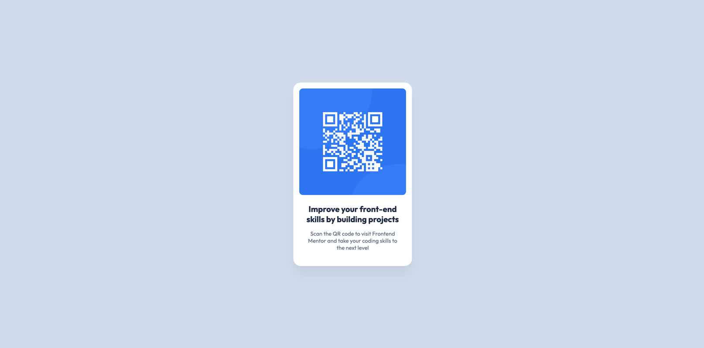

# QR code component

Hey folks!
Just my first little piece of code, after long break from html and css.

Hopefully this time my coding journey won't end up after a month :-D

As for now, code uses hex colours values, but I'm excited to spend some time on learning how to work with Figma tokens.
Gonna get to know Flexbox a bit better as well. 

Best!

